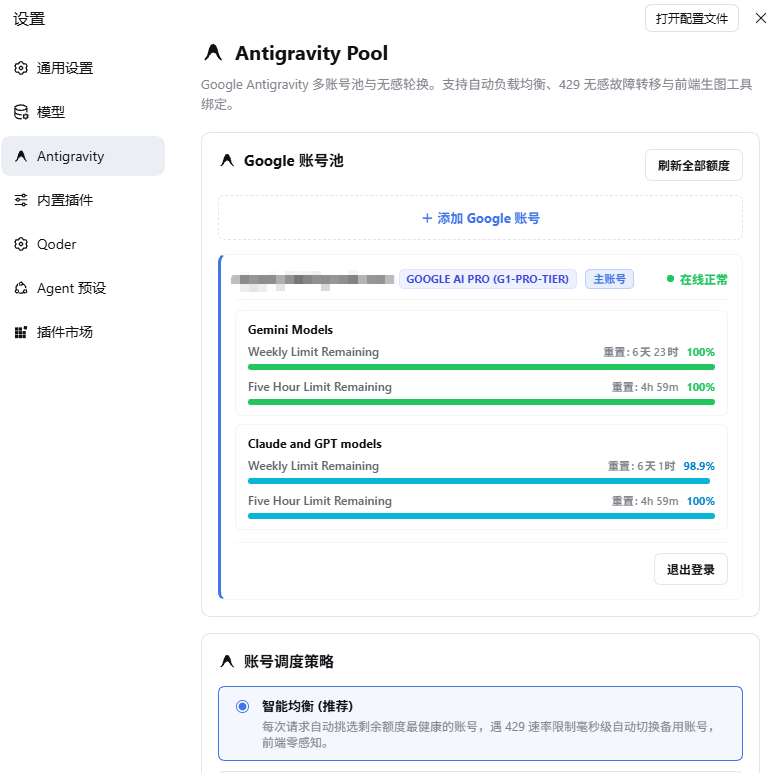
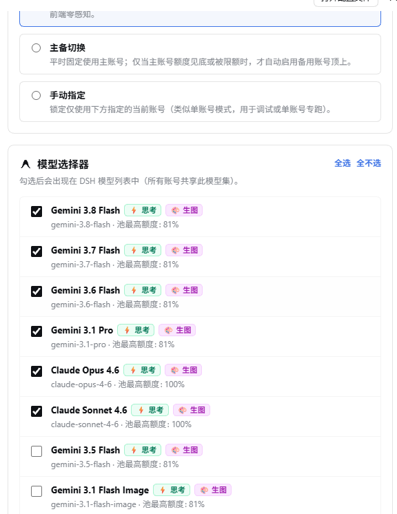
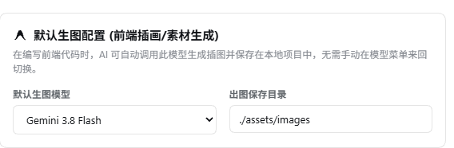

<div align="center">

### dsh-gemini-pool

**DSH 用上 Gemini 的方式 —— 让你的 Google AI Pro 订阅，成为编程模型池**

[English](./README.en.md) · 简体中文

<a href="https://github.com/qikairo7/dsh-gemini-pool/releases"></a>
<a href="https://github.com/qikairo7/dsh-gemini-pool/stargazers"></a>
<a href="https://github.com/qikairo7/dsh-gemini-pool/issues"></a>
<a href="./LICENSE"></a>
<a href="https://github.com/qikairo7/dsh-gemini-pool/commits/master"></a>
<a href="https://github.com/qikairo7/dsh-gemini-pool/actions/workflows/check.yml"></a>

[GitHub](https://github.com/qikairo7/dsh-gemini-pool) ·
[Issues](https://github.com/qikairo7/dsh-gemini-pool/issues) ·
[更新日志](./CHANGELOG.md) ·
[安全策略](./SECURITY.md) ·
[DeepSeek Harness](https://github.com/deepseek-ai/deepseek-harness) ·
[上游项目](https://github.com/LiZhenNet/dsh-antigravity)

</div>

---

## ✨ 这是什么

[DeepSeek Harness（DSH）](https://github.com/deepseek-ai/deepseek-harness) 本身无法直连 Gemini。这个插件打通了那条路：通过 Google Antigravity / Cloud Code Assist 通道，把你已有的 **Google AI Pro 订阅**直接接入 DSH —— 不用另买 API key，订阅额度即用即扣。

Gemini 的强项正好落在编程场景上：**多模态**看图、**前端与 UI** 代码生成质量出色，还能**生图**做界面素材。装上插件后，这些能力按订阅额度直接在 DSH 里使用。

不止一个 Google 账号？全部加进来组成**账号池**：额度自动均衡、429 无感切换、坏号自动冷却与探活恢复。设置页里每个账号一张卡片，每周与 5 小时额度实时可见。

<p align="center">
  
</p>

---

## 🆚 为什么需要它

装与不装，同一个 Google AI Pro 订阅是两种用法：

| | 不装：订阅只在网页版 | 装：订阅接入 DSH |
|---|:---:|:---:|
| Gemini 多模态（看图） | ❌ 编程时用不上 | ✅ 对话里直接丢图 |
| 前端 / UI 代码生成 | ❌ 网页版没有工程上下文 | ✅ 直接读懂你的项目 |
| 生图做界面素材 | ⚠️ 来回切换复制 | ✅ `antigravity_image_generate` 自动出图入库 |
| 多账号额度 | — | ✅ 全池调度，429 无感切换 |
| 额度情况 | ❌ 黑盒 | ✅ 每账号实时额度条 |
| 坏账号 | ❌ 反复撞死号 | ✅ 自动禁用 + 探活复活 |

> 使用本插件前，请先阅读下方的「⚠️ 封号风险」。

---

## ⚠️ 封号风险，使用前必读

本插件是非官方第三方工具，通过复用 Antigravity 客户端身份访问 Google 接口。**Google 已官方确认：使用第三方工具访问 Antigravity 资源属于服务条款违规，并已实施过大规模封禁**（见 [gemini-cli 官方公告](https://github.com/google-gemini/gemini-cli/discussions/20632)，2026 年 2 月，付费用户亦被波及）。

**处罚机制**（Google 官方公布）：

- 首次违规 → 邮件通知 + 填表重新认证 → 1~2 天自动解封
- **第二次违规 → 永久封禁**
- 封禁范围：多数报告为 Antigravity / Gemini 通道被封（已购订阅额度一并作废）；**是否连坐整个 Google 账号（Gmail / Drive），Google 被社区两次追问均未正面回答**——请按最坏可能对待
- 执法为抽查式：大量第三方工具用户数月无事，但**没有人能保证下一个不是你**

**降低风险的三条建议**：

1. **用小号**——专门注册的 Google 账号，不要用绑着重要资产的主力号
2. **克制用量**——内置的指数退避与冷却机制有助于此，但别刻意压测额度上限
3. **做好通道随时失效的准备**——接口是 Google 的，政策随时可能收紧

使用本插件即表示你已理解并自愿接受上述风险。本项目与 Google 无任何关联。

---

## 🆚 和 API 中转站有什么区别

也可以去中转站按 token 付费买 Gemini API——那是另一种取舍：

| | API 中转站 | dsh-gemini-pool |
|---|:---:|:---:|
| **钱** | 按 token 加价，站长赚差价 | 订阅费固定，用多少都是那份钱 |
| **模型真假** | ⚠️ 可能被悄悄降级，难察觉 | ✅ 直连官方端点，模型永远是真的 |
| **数据隐私** | ⚠️ 代码/对话/截图全部经过站长服务器 | ✅ 进程内直连 Google，不经过任何中间人 |
| **额度透明** | 只剩一个"站点余额"数字 | 每账号每周 / 5 小时实时进度条 |
| **跑路风险** | 站点跑路降质是常态，余额一夜清零 | 无第三方经手你的钱 |

中转站的真实优势只有一条：**封号砸的是站长的号，你的账号干净**。所以分界线很简单——怕账号出事、用量小、想试用，选中转站；有订阅、重隐私、要真模型、长期用，选这里。

---

## 🚀 快速开始

**1. 安装插件**

```sh
dsh plugin --profile web add github:qikairo7/dsh-gemini-pool
```

**2. 登录 Google 账号**

打开 DSH 设置 → **Antigravity** → 点击「＋ 添加 Google 账号」完成授权。想加几个加几个。

**3. 完成**

模型选择器里勾选要用的模型，直接开聊。额度刷新、账号调度全部自动。

<details>
<summary><kbd>离线安装 / 手动安装</kbd></summary>

```sh
npm run pack:dist
# 包名带 package.json 里的当前版本号，按 dist/ 下实际生成的文件名安装
dsh plugin --profile web add ./dist/dsh-gemini-pool-*.tgz
```

若 DSH 版本不支持 `dsh plugin add`，手动复制包到 `$DSH_HOME/profiles/web/node_modules/`，并在 `cordis.patch.yml` 中添加：

```yaml
- insert:
    - id: dsh-gemini-pool
      name: dsh-gemini-pool
```

</details>

---

## 💧 账号池与调度

三种调度策略，设置页一键切换：

- **智能均衡（推荐）** — 自动挑选剩余额度最健康的账号
- **主备切换** — 固定主账号，额度耗尽自动切备用
- **手动指定** — 锁定单一账号，用于调试或专跑

凭证存储在 `$DSH_HOME/storages/antigravity-pool-accounts.json`，包含 access 与 refresh token，请妥善保管。旧版单账号凭证升级时自动迁移，无需重新登录。

---

## 🧊 冷却与自愈

账号遇到 429 后自动进入指数退避冷却，连续失败达阈值则禁用并转入后台探活，额度恢复即自动回归，全程无需人工干预。

| 参数 | 默认值 | 说明 |
|---|---|---|
| `cooldownMs` | 1 分钟 | 首次冷却时长，之后逐次翻倍 |
| `cooldownMaxMs` | 1 小时 | 冷却时长上限 |
| `disableThreshold` | 5 次 | 连续失败达到即禁用该账号 |
| `probeIntervalMs` | 5 分钟 | 后台探活间隔，恢复即自动启用 |

被禁用的账号在设置页显示红色标签，可点「重新启用」一键恢复。以上参数均可在设置页「冷却与恢复」折叠区调整。

---

## 🤖 模型一览

设置页勾选即用，已勾选的模型自动置顶，每个模型实时显示池内最高可用额度。

<p>
  
</p>
<p>
  
</p>

| 模型 | 额度池 |
|---|---|
| Gemini 3.8 / 3.7 / 3.6 / 3.5 Flash | Gemini |
| Gemini 3.1 Pro · Gemini 3.1 Flash Image（生图） | Gemini |
| Gemini 3 Flash · Gemini 2.5 Pro / Flash | Gemini |
| Claude Opus 4.6 · Claude Sonnet 4.6 · GPT-OSS 120B | Claude & GPT |

同一额度池内共享每周与 5 小时额度；额度按 token 成本比例消耗，越重的模型烧得越快。

---

## 🔗 相关插件

[dsh-codearts-auth](https://gitee.com/iJetLi/deepseek-harness-codearts)（作者 [Jet](https://gitee.com/iJetLi)，MIT）：同为 DSH 插件，聚合 9 个 provider 的登录、账号池、自动续期与积分查询 —— CodeArts、CodeBuddy、WorkBuddy、LobsterAI、Qoder、TRAE、Cline、Loomy、Raccoon，设置入口统一在 Jet Hub。

两者覆盖的通道不重叠，可以同时安装：

| | 本插件 | dsh-codearts-auth |
|---|---|---|
| 通道 | Google Antigravity / Cloud Code Assist | 上列 9 家平台各自的接口 |
| 额度来源 | 你自己的 Google AI Pro 订阅 | 各平台账号额度 |
| provider 路由 | `antigravity` | `codearts`、`buddy`、`workbuddy`、`lobsterai`、`qoder`、`trae`、`cline`、`loomy`、`raccoon` |
| 账号池 | 多个 Google 账号，按剩余额度选号 | 各 provider 独立账号池 |

它的模型目录里也有 Gemini 模型（WorkBuddy 国际版 `gemini-3.5-flash`、Cline `cline-free/gemini-3.8-flash`、TRAE `custom_model_gemini`），但走的是第三方平台通道，消耗该平台的额度，与本插件所用的 Google 订阅额度无关。要接那 9 家平台直接装它即可，本插件不重复覆盖这些通道。

两个插件都以 `dsh.bundle.patch` 声明接入，profile 的 layer 栈分别拾取 `dsh-gemini-pool` 与 `codearts-auth`，互不覆盖。

---

## 📄 许可证与致谢

[MIT](./LICENSE)。

基于 [@LiZhenNet](https://github.com/LiZhenNet) 的 [dsh-antigravity](https://github.com/LiZhenNet/dsh-antigravity) 构建，感谢 [@Lukeknow0](https://github.com/Lukeknow0)、[@miuzel](https://github.com/miuzel)、[@grloper](https://github.com/grloper)、[@sereineele](https://github.com/sereineele) 的社区贡献。
